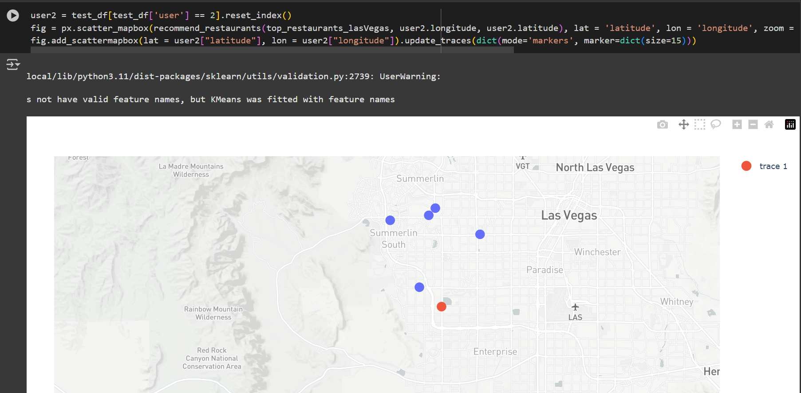

# Restaurant Data Analysis & Recommendation System

## 📊 Project Overview
This project analyzes the Yelp academic business dataset to gain insights into restaurants across the U.S., with a focus on Las Vegas. It visualizes restaurant distributions, performs clustering using K-Means, and provides restaurant recommendations based on geographic location.

## 📁 Dataset Used
- **Source**: [Yelp Open Dataset](https://www.dropbox.com/s/3x1w789mmuae3ao/yelp_academic_dataset_business.zip)
- **File**: `yelp_academic_dataset_business.json`
- **Contents**: Business name, location, star ratings, review count, and categories.

## 🔧 Installation & Requirements
### Install Required Libraries:
```bash
!pip install pandas numpy matplotlib seaborn folium plotly geopandas descartes scikit-learn
!pip install git+https://github.com/geopandas/geopandas.git
```

### (For Google Colab users)
```bash
!apt install -y gdal-bin python3-rtree
```

## 📌 Project Workflow
### 1. **Data Preprocessing**
- Filtered only businesses that fall under the "Restaurants" category.

### 2. **Visualizations**
- **Map 1**: All restaurants on a scatter map (Plotly Mapbox)
- **Map 2**: Top 20 restaurants by review count and star ratings
- **Map 3**: Restaurants in Las Vegas (zoomed view)
- **Chart**: Countplot of star ratings using Seaborn

### 3. **Clustering with K-Means**
- Applied the **Elbow Method** and **Silhouette Score** to determine the optimal number of clusters.
- Clustered Las Vegas restaurants into 5 groups based on latitude and longitude.

### 4. **Map Visualizations of Clusters**
- **Map 4**: Clustered restaurants in Las Vegas

### 5. **Restaurant Recommendation System**
- Recommends top restaurants from the same cluster as the user’s location.
- **Maps 5–7**: Recommendations for 3 sample users based on coordinates

## 📷 Embedded Maps (Screenshots)
### Map 1: All Restaurants with Ratings


### Map 3: Restaurants in Las Vegas


### Map 4: Clustered Restaurants in Las Vegas


### Map 5: Recommendations for User 1


### Map 6: Recommendations for User 2


### Map 7: Recommendations for User 3


## 📌 Recommendation Function Example
```python
def recommend_restaurants(df, longitude, latitude):
    cluster = kmeans.predict(np.array([longitude, latitude]).reshape(1, -1))[0]
    return df[df['cluster'] == cluster].iloc[0:5][['name', 'latitude', 'longitude']]
```

## 🚀 How to Run This Notebook
- Use Google Colab or Jupyter Notebook
- Upload the dataset
- Run the cells sequentially

## 📎 Conclusion
This project demonstrates how geographic and review-based features can be used to cluster and recommend restaurants effectively. The interactive maps enhance exploratory data analysis and provide intuitive visual insights.


